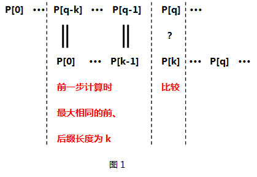
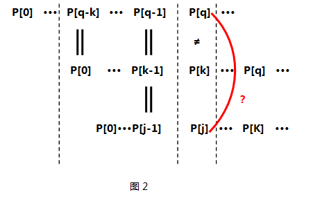

#KMP 算法
```C
母串：abcabaaabaabcac      .     abcabaaabaabcac
字串：abaabcac             .           abaabcac
```
###普通匹配算法：
* 
策略：
双指针，一个指向母串x，一个指向子串y，初始化都为0：
    * 
如果下标对应的字符相等，则两个指针都自加1即比较下一个字符是否相等；
    * 
否则，指向子串的指针归0，即y=0，而指向母串的指针x=x-y+1（此时x和y本轮**自加的次数一定相等**）。即从母串上一轮匹配的地方加一继续重头匹配
* 
算法实现：
```C
int normal_search(string s,string t)
{
        int ret,i,j;
        i = j = 0;
        ret = -1;
        while(i <= s.size() && j != t.size())
        {
            if(s[i] == t[j])
            {
                ++i;
                ++j;
            }
            else
            {
                i = i - j + 1;
                j = 0;
            }
        }
        if( j == t.size() )
            ret = i - j;
        return ret;
}
```

##KMP算法
"前缀"指除了最后一个字符以外，一个字符串的全部头部组合；"后缀"指除了第一个字符以外，一个字符串的全部尾部组合。
* 
策略：
    * 
我们从普通算法可知：如果当前匹配失败，那么子串从头开始（j = 0），母串下标为本轮开始匹配的地方加（i = i - j + 1）；
    * 
KMP三个人分析，如果匹配如下所示：匹配到```Si != Tk```，前面的k-1个都相等
```C
    母串S：  S0 S1 S2 S3 S4 ... 【Si-k Si-k+1 Si-k+2 ... Si-2 Si-1】 [Si] Si+1 ... Sx  ... Sn-2 Sn-1
    字串T：                     【T0   T1     T2  . . .  Tk-2 Tk-1】 [Tk] Tk+1 ... Tm-1
                                            相匹配的范围                不等
```
那么```Si != Tk```的话，按照普通算法，那么```k = 0; i = i - k + 1;```，然后继续匹配；<br>
但是我们忽略了我们已经匹配过前k个了：即```【Si-k Si-k+1 Si-k+2 ... Si-2 Si-1】 = 【T0   T1     T2  . . .  Tk-2 Tk-1 】 ```
<hr>
    * 
假若Si在我们将来字串成功匹配的范围之内,即```【Si-j Si-j+1 ... [Si] ... Si-j+m】 = 【T0   T1     T2  . . .  Tm-2 Tm-1 】(j<k)```<br>即Si前面有j个字符等于子串的前j个字符
        1.  
KMP算法就是这个思想：既然Si前面会有j个字符与子串的前j个字符相等，那我们为什么不直接从子串的第j的字符处继续和母串的第i个字符处Si继续比较呢
```C
    母串S：  S0 S1 S2 ... [Si-k] ... 【Si-j Si-j+1 Si-j+2 ... Si-2 Si-1 [Si] Si+1 ... Sx】  ... Sn-2 Sn-1
    字串T：                          【T0   T1     T2  . . .  Tj-2 Tj-1 [Tj] Tj+1 ... Tm-1】
                                                             j个匹配的                新起点
```
            1. 
而且我们发现Si前面的j个字符同时也是我们子串中的字符啊！！！正常匹配到```Si != Tk```，<br>```【Si-k Si-k+1 ... [Si-j] ... Si-2 Si-1】 = 【T0 T1 T2 ... Tj-1 [Tj] ... Tk-2 Tk-1 】```　
```
母串S：  S0 S1 S2 S3 S4 ... 【Si-k Si-k+1 ...　Si-j ... Si-2 Si-1】 [Si] Si+1 ... Sx  ... Sn-2 Sn-1
    字串T：                     【T0 T1 T2 .  .  . Tk-j ... Tk-2 Tk-1】 [Tk] Tk+1 ... Tm-1
匹配成功后：
母串S：  S0 S1 S2 S3 S4 ... Si-k Si-k+1 ... 【Si-j ...  Si-2 Si-1】 [Si] Si+1 ... Sx  ... Sn-2 Sn-1
    子串T：                                     【T0 T1 ... Tj-2 Tj-1】 [Tj] Tj+1 ... Tm-1
　
由上分析可知：【Si-j ... Si-2 Si-1】这部分即等于【Tk-j ... Tk-2 Tk-1】，又等于【T0 T1 ... Tj-2 Tj-1】；
所以可以得出：对于S[i]前面的k+1个子字符串中，前j个字符和后j个字符相等；
　　　　　　　也就是Tk前面的k+1个子字符串中，前j个字符和后j个字符相等；
```
            1. 
所以：**这前j个字符既是子串T的前j个字符，也是Tk处前面的j个字符，即Tk前面的k+1个子字符串中存在首部j个和尾部j个相同的串：**
```C
【T0 T1 ... Tj-1 ... Tx ... Tk-j ... Tk-1 Tk ... Tm-1】
　|　　　　　｜　　　　　　　　｜　　　　｜   *
　－－－Z－－－　　　　　　　　－－Z －－－   *
即这两部分相同
```
            1. 
故我们只要针对子串的每一个下标(比如此处是K)求出其前后缀相同的子字符串的长度====》即Z大小；每次匹配到这里不匹配时，新的带匹配子串下标就等于该长度；
    * 
假若Si不在将来匹配成功的范围内，那么很简单：```j = 0;i = i;```即从Si这里开始比；
    * 
我们记i前后缀j个相同：```【T0 ... Tj-1】 = 【Ti-k ... Ti-1】```
* 
算法实现
    * 
求出[辅助数组](http://www.cnblogs.com/c-cloud/p/3224788.html)next[]：即子串每个下标(比如上面提到的K)对应的同缀长度Z即可.<br>
        * 
next[0]和next[1]都是0（前提是子串长度大于2个）；
        * 
对于next[i]：我们已知next[i-1]，即对于S[i-1]前面的子字符串中Z的大小为next[i-1];
            * 
所以如果S[i-1] = S[next[i-1]]，那么S[i]对应Z的大小就是S[i-1]对应的Z加上1（第一张图所示）
```C
    对于i-1：前面已知有next[i-1]个前后缀相同的字符了
　　　　　T0 ... Tj-1 Tj　...  Ti-j ... Ti-2 Ti-1 即【T0 ... Tj-1】 = 【Ti-j ... Ti-2】
    对于i ： 如果S[i-1]和S[next[i-1]]相同，那么对于i前后缀匹配的字符串长度比i-1多一个
    　　　　　T0 ... Tj-1 Tj　...  Ti-j ... Ti-2 Ti-1 即【T0 ... Tj】 = 【Ti-j ... Ti-1】
    如果不同：就是i-1个里面可能有匹配的，就是说前面i-1个里面还是前后缀的问题!!!!
```

    ```C++
    
    void get_next(string &str,int *next,int len)
    {
                    next[0] = 0;
                    next[1] = 0;
                    int i = 2;
                    //首先判断str[i - 1] == str[next[i - 1]]，如果等就是说已有的Z直接加1即可
                    //如果不等：对于已有的前后缀相同的串，不断减少1个看是否匹配
                    while(i < len)
                    {
                        if(str[i - 1] == str[next[i - 1]])
                            next[i] = next[i - 1] + 1;
                        else
                        {
                            int temp = next[i - 1];     //已有的前缀长度
                            next[i] = 0;
                            if(temp == 0)               //当然如果为0，next[i]=0即可不用修改了
                            {
                                ++i;
                                continue;
                            }
                            while(temp)                 //否则就继续让前缀少一个，然后比较
                            {
                                temp -= 1;
                                if(str[i - 1] == str[temp])
                                {
                                    next[i] = temp + 1;
                                    break;
                                }
                            }
                        }
                        ++i;
                    }
    }
        void makeNext(const char P[],int next[])
{

   int q,k;//q:模版字符串下标；k:最大前后缀长度
    int m = strlen(P);//模版字符串长度
    next[0] = 0;//模版字符串的第一个字符的最大前后缀长度为0
    for (q = 1,k = 0; q < m; ++q)//for循环，从第二个字符开始，依次计算每一个字符对应的next值
    {
        while(k > 0 && P[q] != P[k])//递归的求出P[0]···P[q]的最大的相同的前后缀长度k
            k = next[k-1];         
        if (P[q] == P[k])//如果相等，那么最大相同前后缀长度加1
        {
            k++;
        }
        next[q] = k;
    }
}
    ```
    * 
实现一样，只是```j = 0;i = x - j + 1;```换成```i不变;j = next[j]```即可
```C
    int kmp_search(string S,string T)
    {
            int len = T.size();
            int next[len] = {0};
            
            get_next(T,next,len;
            for(int i = 0,j = 0;i < S.size() && j != len;)
            {
                if(j==0 || S[i] == T[j])        //j==0：以防无限循环
                {
                    ++i;
                    ++j;
                }
                else
                    j = next[j];
            }
            if(j == len)
                return i - len;
            return -1;
    }
```

###总结
* 
KMP算法在不匹配的时候，子串不再是从头开始
    * 
从开始呢？？子串那里不匹配的，从头到这个地方分割得到一个小的子字符串，得到该子字符串的前后缀相同时的前缀长度
    * 
子串匹配下标即该前后缀的长度
* 
重点：
    * 
原理：```a = b 且 a = c ，那么 b = c；```
<br>注：```【Si-k Si-k+1 ...　Si-j ... Si-2 Si-1 Si】中，【Si-j ... Si-2 Si-1】这部分即等于【Tk-j ... Tk-2 Tk-1】，又等于【T0 T1 ... Tj-2 Tj-1】；  ========================》》》【Tk-j ... Tk-2 Tk-1】等于【T0 T1 ... Tj-2 Tj-1】
```
    * 
就是求子串中每一个下标对应截取子字符串的前后缀相同的长度
    * 
每次不匹配时，不从头匹配而是从对应长度开始匹配。


[返回目录](README.md)
