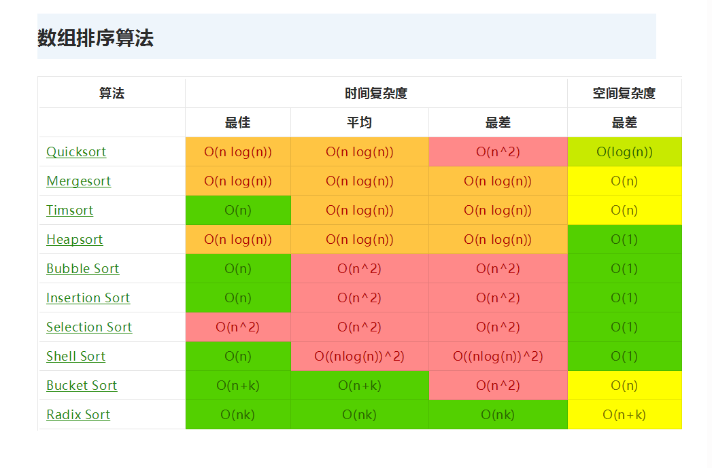

排序分为两种：内部排序和外部排序

## [内部排序](http://blog.csdn.net/hguisu/article/details/7776068)
1. 
冒泡排序：相互比较，小的上浮。一遍只能找到一个
```C
void maopao(int []a)
{
    for(int i = 0;i<a.length;++i)
    {
        for(int j = i;j<a.length;++j)
        {
            if(a[i]>a[j])
                swap(a[min],a[i]);
        }  //没找到一个就换，效率低：下面先找到最终的下标，然后只换一次即可
////////////////////////////////////////////////////////////////////////////////////////
        min = i;
        for(int j = i+1;j<a.length;++j)
        {
            if(a[min]>a[j])
                min = j;
        }
        swap(a[min],a[i]);//先找到最终的下标，然后只换一次即可
    }
}
```

1. 
直接插入排序：当前值与前一个比较，不符合顺序则替换，不断向前走，直至符合或者到达头。
```C
    void insertsort(int *a)
    {
        for(int i = 1; i< a.length();++i)
            for(int k = i;k>0&&a[k]<a[k-1];--k)
                swap(a[k],a[k-1]);
    }
```
1. 
希尔排序(插入排序的一种)又叫**增量排序**：把所有元素根据增量距离分为几组，然后对组内进行直接插入排序；对下一个增量进行希尔排序，最后增量为1即全体直接插入排序。即可
```C
void shellinsert(list &l, int k)
{
        for(int i = 0;i<k;++i)
        {
            for(int x = i+k;x<l.length;x+=k)
                for(int y = x;y>=k&&a[y]<a[y-k];y-=k)
                    swap(a[y],a[y-k]);
        }
}
void shellsort(list &l, int []dlta)
{
        for(int i = 0;i<dlta.length;++i)
            shellinsert(l,dlta[i]);
}
```

1. 
快速排序：一次排序后将待序的序列分为两个部分，一部分全是比关键字大的，另一部分小；然后分别对这两个部分快排。
```C
int partion(int *a,int low,int high)
{
        int p = a[low];          //中心轴的选择很重要：本处选择第一个，可以换成第一个、中间、最后一个
        while(low<high)
        {
            while(low<high&&a[high]>=p)     //注意等于的问题：如果a[high]==p，那么high永远不会减减
                --high;
            a[low] = a[high];
            while(low<hihg&&a[low]<=p)      //注意等于的问题：如果a[low]==p，那么low永远不会加加
                ++low;
            a[high]=a[low];
        }
        a[low]=p;
        return low;
}       //把比关键字大的和小的分开；
void quicksort(int *a,int low,int high)
{
        if(low >= high)    //注意此处
            return ;
        int pivot = partion(a,low,high);    //具体的排序由partion完成：可以直接展开，减少函数调用
        quicksort(a,low,pivot-1);
        quicksort(a,pivot+1,high);
}   //循环快排
//更容易扩展使用的快排：
void quicksort(int *a,int low,int high)
{
        while(low >= high)    //注意此处
        {
            int pivot = partion(a,low,high);    //具体的排序由partion完成：可以直接展开，减少函数调用
            quicksort(a,low,pivot-1);
            quicksort(a,pivot+1,high);
        }
}   //明确：quicksort并未执行排序功能，真正排序的是partion()
　
void quick_sort1(vector<int> &nums,int low,int high)
{
    stack<int> q;
    if(low>high)
        return;
    else
    {
        q.push(low);
        q.push(high);       //每一次压入双下标
        while(!q.empty())
        {
            high = q.top();q.pop();
            low = q.top();q.pop();
            int mid = partion(nums,low,high);
            if(low<=mid-1)  //先判断
            {
                q.push(low);
                q.push(mid-1);
            }
            if(high>=mid+1)
            {
                q.push(mid+1);
                q.push(high);
            }
        }
    }
}   //非递归实现
　
void Qsort(int *a)
{
        int k= 0;
        while(a[k]) ++k;
        int low,high,mid;
        low = 0,high =k;
        quicksort(a,low,high);
}
```
注：
    * 
快排的排序在partion函数中完成
    * 
快排在基本有序的情况下很慢，O（N*N）与O（N）
    * 
快排的效率很大情况下由中心轴的选择决定的，**优化点：**  
        1. 
不选择第一个作为轴，而是选择第一个、中间、最后一个的中间值作为轴心值
        1. 
当子数组小于一个阀值是用插入排序而不是快排

1. 
简单选择排序：每次选择最小的和第一个的元素互换
```C
int selectmin(int *a,int start)
{
        int ret = start;
        for(int i = start+1;i<a.length;++i)
            if(a[ret]<a[i])
                ret= i;
        return ret;
}
void select(int *a)
{
        for(int i = 0;i<a.length;++i)
            {
                int index = selectmin(a,i);
                swap(a[i],a[index]);
            }
}
```

1. 
[堆排序](http://blog.csdn.net/morewindows/article/details/6709644)(选择排序的一种)：大小根堆，所有元素大于/小于根；
    * 
建立堆：
        * 
把数组保存的元素按完全二叉树建立：**第一个非终端节点是第floor(n/2)个，自下向上调整**，调整以该节点为根节点的堆；
        * 
不断递减下标并重复上述操作到第一个元素
    * 
输出堆顶后调整：
        * 
输出堆顶元素，然后**把最后一个元素放到堆顶，自上向下调整堆。**
    * 
插入堆：**元素放到最后，自下向上调整堆（只需要调整直系父亲节点）；**

```C
/* 数组表示完全二叉树：第一个非终端节点是第floor(n/2)个元素，子节点下标：2i 、2i+1
// 只需要从floor(n/2)开始递增到1,判断每个节点的左右子树是否满足大小根要求即可。
*/
void heapinsert(int *a,int val) //放到最后啊！~！
{
    int l = 0;
    while(a[l]) ++l;
    a[l]=val;   //此处错误，仅为了表示需要
    for(int i = ceil(l/2)-1;i>=0;i=ceil(i/2)-1) //自下向上仅调整父亲
    {
        if(a[l]<a[i])
            swap(a[i],a[l]);
        l = i;
    }
}
void buildheap(int *a)
{
    int l = 0, mid;
    while(a[l]) ++l;
    mid = floor(l/2)-1;
    for(int i = mid;i>=0;--i)    //第一个非终端节点是第floor(n/2)个元素，自下向上调整
    {
        if(a[2*i+2]>a[2*i+1])
            if(a[i]>a[2*i+1])
                swap(a[i],a[2*i+1]);
        else if(a[i]>a[2*i+2])
            swap(a[i],a[2*i+]);
    }
}
void adjheap(int *a)
{
    cout<<"the minum is: "<<a[0]<<endl;
    int l = 0,mid;
    while(a[l]) ++l;
    mid = floor(l/2)-1;
    a[0]=a[l-1];
    a[l-1]=NULL;    //此处仅表示拿掉一个元素

    for(int i =0;i<=mid;++i)    //自上向下调整堆
    {
        if(a[2*i+2]>a[2*i+1])
            if(a[i]>a[2*i+1])
                swap(a[i],a[2*i+1]);
        else if(a[i]>a[2*i+2])
            swap(a[i],a[2*i+]);
    }
}
void heapsort(int *a)
{
    int j= 0;
    while(a[j]) ++j;
    buildheap(a);
    for(int i=0;i<j;++i)
        adjheap(a);
}
```
7.　归并排序：m-路归并。初始时n个元素即n个有序序列，然后**连续的m个一组，组内排序**；上步结束后的一组为一个，然后继续选连续的m个一组；重复上述操作直至得到一个长度为n的序列即可。<br>
核心：将m个相连的有序序列归并为一个有序的序列
```C
//二路归并：主要就是合并两张表 = s~m和m+1~e
void merge(int *a,int s,int m,int e)   //将有序序列a[s...m-1]与a[m...e]归并为a[s...e]
{
    int *temp;  //临时数组辅助保存
    int t = 0;
    for(int i =s,j=m+1;i<=m,j<=e;++t)
    {
        if(a[i]>a[j])
            temp[t] = a[j++];
        else 
            temp[t] = a[i++];
    }
    while(i<=m) temp[t++] = a[i++];
    while(j<=e) temp[t++] = a[j++];
    a = temp;
}
void mergesort(int *a,int s,int e)
{
    int l = 0;
    while(a[l]) ++l;
    if(s<e)
    {
        //mid = (s+e)/2;        /*注意防止溢出 */
        mid= s+(e-s) >> 1;
        mergesort(a,s,mid);
        mergesort(a,mid,e);
        merge(a,s,mid,e);
    }
}
```
8.　基数排序：不通过元素间的比较和移动来实现。通过关键字来实现：先排主关键字，然后对主关键字同的次关键字排...直至结束。


## 比较
| 排序方法 | 平均时间复杂度 | 最坏时间复杂度 | 空间复杂度 | 稳定性 |
| -- | -- | -- | -- | -- |
| 冒泡排序 | O（N<sup>2</sup>） | O（N<sup>2</sup>） | O（1） | 稳定 |
| 直接插入排序 | O（N<sup>2</sup>） | O（N<sup>2</sup>） | O（1） | 稳定 |
| 简单选择排序 | O（N<sup>2</sup>） | O（N<sup>2</sup>） | O（1） | 不稳定 |
| 快速排序 | O（N*logN） | O（N<sup>2</sup>） | O（logN） | 不稳定 |
| 堆排序 | O（N*logN） | O（N*logN） | O（1） | 不稳定 |
| 希尔排序 | O（N<sup>1.5</sup> /N<sup>2</sup>！） | O（N<sup>2</sup>） | O（1） | 不稳定 |
| 归并排序 | O（N*logN） | O（N*logN） | O（n） | 稳定 |
| 基数排序 | O（d*（n+r*d）） | O（d*（n+r*d）） | O（r*d） | 稳定 |



### 总结
* 所有简单排序除了简单选择都是稳定的，所有复杂排序除了归并都是不稳定的；基数是稳定的
* 
选择排序前的准备和考量：
    * 
数据量n的大小
    * 
本身顺序情况
    * 
稳定性要求
    * 
时间、空间复杂性
* 
 堆排序与快速排序，归并排序一样都是时间复杂度为O(N*logN)的几种常见排序方法。
* 
归并排序和快速排序、基数排序是需要额外内存空间的
* 
堆排序、快排、希尔性能最好，但是不稳定
* 
输入有序或逆序时快速排序很慢，在其余情况则表现良好。如果输入本身已被排序，那么就糟了。基本有序时冒泡可以达到O(N)
* 
内部排序最坏是O（N<sup>2</sup>），最好用希尔可以达到O（N<sup>1.3</sup>）
* 基本有序用堆排(绝对不能用快排)，相对无序用快排


## 外部排序：先分段再排序
**数据量比较大而且内存无法装下的时候，我们可以采用外排序的方法来进行排序，**
1. 
多路平衡归并
1. 
最佳归并树
1. 
置换-选择

[返回目录](README.md)