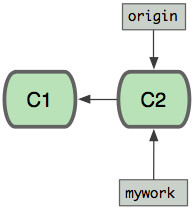
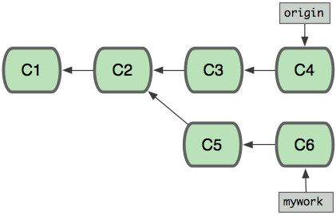
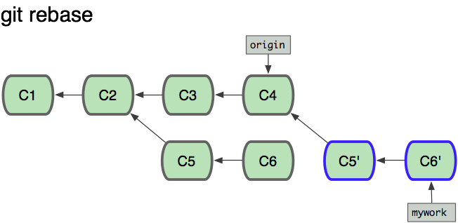
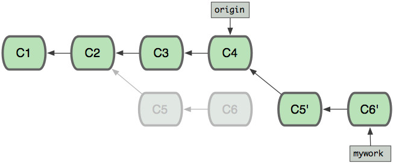

1.安装
* windows： 直接下载
* Linux：apt－get、yum等
* Mac： 
        * 需要brew（https://brew.sh/index_zh-cn.html）
        * 命令行中运行：
        /usr/bin/ruby -e "$(curl -fsSL                         https://raw.githubusercontent.com/Homebrew/install/master/install)" 即可

git version  查看git版本
git config --list  配置信息

1. 
配置
```c
配置文件：
        1)etc/.gitconfig   整个system
        2)~/.gitconfig     用global,当前用户。也是默认的
        3)./.git/config    本仓库
$git config [--global/system] user.name "yourname"
$git config [--global/system] user.eamil "email"    // global/system/无
$git config [--global/system] color.ui true   颜色
$git config [--global/system] alias.st status  重命名命令---别名
$git config [--global/system] core.editor vim/emacs    设默认编辑器
$git config [--global/system] merge.tool vimdiff       比较工具
$git config --global core.fileMode false 文件权限变更不属于变化
写忽略文件：Git工作区的根目录编写 .gitignore文件(init之前写)
        规则：(一行一个)
            #   代表注释
            *   代表任意字符或字符串
            ！  不忽略
            ？  任意字符
        example：
            *.md        忽略所有 .md文件
            !tt.md      忽略除tt.md的所有 .md文件
            folder      忽略folder文件夹及子文件
                    /folder 忽略项目根目录下folder文件
            folder/     忽略该目录
            *.[o]       忽略所有 .o文件
            *a/a*       忽略所有以a结尾/开头的文件
    只能作用于 Untracked Files，也就是那些从来没有被 Git 记录过的文件。
    正确的做法是在每个clone下来的仓库中手动设置不要检查特定文件的更改情况。git update-index --assume-unchanged PATH    在PATH处输入要忽略的文件。
销毁git库：
        rm -rf .git即可
```
1. 
本地使用
```c
        工作区--add-->暂存区--commit-->版本仓库------>push------>远程仓库
man git [command]     查看帮助
生成key：
        ssh-keygen -t rsa -C "your-email" 在HOME目录下会有.ssh目录。
      HOME目录默认：/home/[user]/.ssh（linux）
                   HOME环境变量对应的目录中(win)
      win下使用git时DOS界面默认路径：设置快捷方式的起始地址，如果不行在环境变量中增加HOME路径即可。
      不过上面的生成key的目录，因为默认路径也变了。
git init        :初始化一个本地仓库
git add file1 file2 ... :添加文件
git add ./-A/-u  :  添加所有除了删除的/添加所有/添加除新建之外的
git add -p      交互式提交某些内容
git commit -m "instruction" [-a] :  提交的说明。加[-a]只对已提交过的文件有效
git status  : 仓库状态
git log [--pretty=oneline]  历史记录
    参数：
        --oneline   一行显示
        --name-only 只显示变更文件的名称
        --author="someone-name" 只显示某个用户的更改
        --reverse   按逆序显示
        --graph     显示所有依赖树
        --after="date"    显示该日期之后的提交
        --before="date"   该日期之前的提交
        --no-merges [master]..    显示尚未合并到master的变更
        --pretty=oneline/[para] 自定义输出
        -p [file]       显示某个文件的详细变化(每次提交详细信息)，
        -L [s,e]:[file] 显示某个文件s~e行之间的变化
        Bname..B1name    B1分支别B分支多的内容
        Bname...Bname    两个分支不同之处
    例子：某个用户、时间段、那个文件，都可以详细列出
        git log --author="leo" --after="1 week ago" --oneline   一周之内leo的提交,一行显示
        git log -p git.md       git.md的提交和具体改变
git reflog   查看历史commit-id(包括已经被删除的commit记录)
git diff [-w] [file1]  ： 文件[file1]的改动     -w意味着空格改变不会显示 
        * diff 默认对比的是暂存区和工作区的不同
git blame [-w] file1  查看文件被修改的所有信息  （注意 git log -p参数）
[版本回退](https://dev.to/neshaz/when-to-use-git-reset-git-revert--git-checkout-18je)：
        0)回退到某一次提交(整体)： git checkout [commit-id]／file
            * checkout 丢掉工作区的修改
            * 对于file来说：回到最近一次git commit/add 的状态（可以理解为commit之前也有add）
            * 对于commitId来说：回到最近一次git commit 的状态
        1)仍在工作区未add:  git checkout --filename1  返回到最近的已提交状态
        2)已提交commit： git reset --hard HEAD~[i]／commit－id  回退到该状态===『之后的提交commit-id即历史都没有了』
                 git reset --soft HEAD~[i]  回退（之后的变化处在暂存区，commit即可,但历史亦无）
                * 注意：回去后，git log没有了之后的。好比21世纪回到19世纪，看不到20世纪了（想看之前的通过git reflog即可）。
                * reset可以回退版本，也可以将暂存区修改回到工作区
        3)特殊： git revert [HEAD~/commid-id]   把该提交重新做一次
                                        （像是先回到该指定状态，后commit。即提交历史：新加一次）
前进：回退多了
        git reset --hard commit-id
            * 有可能commit-id忘记了，git reflog记录我们所有的命令
删除文件：
        git rm file1
        git commit -m ...
删除恢复：
        git checkout --file
HEAD永远指向当前工作分支
git checkout 把版本库中的文件覆盖工作区文件
分支：
        git checkout -b [Bname] 新建并切换
        git checkout -b [Bname] [rname]/[rbname] 新建对应远程本地分支，名字可以不一样
        git branch [Bname]       新建分支
        git checkout [name]     切换分支
                1）如果本地分支，切换。
                2）如果是远程分支，新建对应远程的本地分支
        git branch -d/-D [Bname] 删除/强制删除        
        git push [remote-name] --delete [Bname] 删除远程分支
        git fetch [Bname]        先取来不合并。（后慢慢merge）
        git merge [Bname]        把分支合并到当前分支。并不会删除分支，如果继续提交会有新的！
            合并时会有冲突：默认Fast-forward模式,自己解决
            解决好了之后，add   commit   pull即可(比忘记删标记)
        git merge --no-ff -m "instruction" [Bname]    保存该分支的历史
        git rebase [Bname]      先把当前的当成补丁dispatch保存，后以Bname为基准，然后将补丁应用到此
        git branch -a - merged  已完全合并到master分支的分支
        git show [Bname]:[file]   查看其他分支文件
        git diff [Bname]:[file]   查看其他分支文件与当前分支的不同
        git diff [C_Bname]/[F_Bname]   查看下载来的分支文件与自己的不同
        git pull --rebase   远程分支合并到本地，然后将本地变更应用到该版本（多人更新时）
                就是将远程的作为基准，然后把本地修改加入进去
1、master分支是一条线，Git用master指向最新的提交，再用HEAD指向master，就能确定当前分支，以及当前分支的提交点
2、新建一个分支dev，Git会新建一个指针dev，指向master分支相同的提交，再把HEAD指向dev，即表示当前分支在dev上。
3、Git创建一个分支很快，因为除了增加一个dev指针，改改HEAD的指向，工作区的文件都没有任何变化！＝＝》接下来都是dev分支向前走，master不变
分支信息：
        git branch -v       本地分支信息
        git branch -a       本地加远程所有分支
        git branch -a - merged  已完全合并到master分支的分支
        git remote -v       远程分支url
        git branch -r       远程分支名
        git branch -m [old] [new] 改分支名字.
        git shortlog -n     查看当前仓库提交情况（每人提交次数按大小排序）
保存当前工作环境：
        git stash       保存现场
            do something else
        git stash apply [id]
        git stash drop  删除
        git stash pop    恢复现场，相当于上面两个指令
        git stash list      所有
标签：当前版本的快照
        git tag    查看所有标签
        git tag [t-name]    默认给最新提交新建标签
        git tag [t-name] commit-id  给指定提交建标签
        git tag -a [t-name] -m "instruction" commit-id  与上同，只是有说明
        git show [t-name] 列出标签详细信息。按字母顺序而不是时间
        git push [remote-name] [t-name]/--tags   推送某一标签/推送所有标签
删除标签：
        1)本地：git tag -d [t-name]
        2)远程：git tag -d [t-name] 后 git push [remote-name] :refs/tags/[t-name]。有空格
        Git的标签虽然是版本库的快照，但其实它就是指向某个commit的指针
        （跟分支很像对不对？但是分支可以移动，标签不能移动）
查找出错的版本：git bisect 采用二分法
        1)git bisect start  开始二分查找，git告诉你一个版本去测试
        2)git bisect good  告诉git当前版本正常（加参数[commid-id]即可告诉git该版本是正常的不用测试了）
        3)git会继续给你一个版本（中间版本）去测试
        4)git bisect bad    告诉git当前版本有问题，git bisect结束
        5)git bisect reset  返回到初始状态
        6)git bisect log    最后一个完全成功的日志
        7)以上过程可以写一个脚本（目前自己也不是很了解，只有实际使用时才会体会更强）
```
1. 
远程库
```c
首先生成认证：
        ssh-keygen -t rsa -C "youremail"  
        然后把生成的 id_rsa.pub内容放到github内
        * -t：指定生成密钥类型（rsa、dsa、ecdsa等）
        * -f：指定存放密钥的文件（公钥文件默认和私钥同目录下，不同的是，存放公钥的文件名需要加上后缀.pub）
绑定：
        git init：保证当前路径下是一个git respository
        git remote add [remote-name] git@github:[yourname]/[respo_name].git
使用：
        git pull
        git pull --rebase   远程分支合并到本地，然后将本地变更应用到该版本（多人更新时）
        git push [remote-name] [localB-name]
        git fetch [Bname]        先取来不合并。（后慢慢merge）
        git diff [Bname]:[file]   查看其他分支文件与当前分支的不同
        git diff [C_Bname]/[Fetch_Bname]   查看下载来的分支文件与自己的不同
        git merge [Bname]        把分支合并到当前分支。并不会删除分支，如果继续提交会有新的！
远程到本地：
        git clone [url] 
            自动为远程仓库新建别名为origin，并下载其中的所有数据，建立一个指向origin的master分支的指针。
        git branch -a       本地加远程所有分支
        git branch -a - merged  已完全合并到master分支的分支
        git remote -v       远程分支url
        git branch -vv       跟踪的远程分支
        git branch -r       列出所有远程分支名
        git branch -m [old] [new] 改分支名字
推送：
        git checkout -b [lBname] [remote-name/Bname] : 建立对应远程的本地分支名，最好名字相同
        git push [remote-name/Bname] [localB-name] ： 指定分支推送
关联：
        1)普通：git remote add ....
        2)指定： git branch --set-upstream [local/lBname] [remote-name/Bname]
                git push -u [remote] [local]     第一次时关联
删除：
        1)删除远程分支：
            git push [remote-name] --delete [Bname]
        2)删除远程仓库绑定：
            git remote rm [remote-name]
修改：
        git remote set-url --push [remote-name] new-url
回退：
        * push时-force，大公司强制不允许(本地git reset后push)
        * 反向a-b-c，变成a-b-c-d，b和d一致即可，保留你的痕迹
重命名：
        git remote rename [old] [new]
升级：
        本地与远程仓库绑定后，每次push 、pull都是和远程仓库的master分支交流，但是我们更多的是需要将更新放到
        自己对应的远程分支上，所以如何将本地的分支推送到远程具体某个分支上：
        git push [r-name] [l-bname]:[r-bname]     将本地分支l-bname作为远程r-bname分支名字
            git push origin test:master             本地test分支，push到远程master分支
            git push origin test:test               本地test分支，push到远程的test分支，没有就新建
            git push origin :test                   删除远程某个分支
            git push [remote-name] --delete [Bname] 删除远程分支
        git rebase [Bname]      先把当前修改当成补丁dispatch保存：以Bname为基准，然后将补丁应用到此
```

###git merge
1. --ff Fast-forward。默认模式，master分支与dev分支，如果dev从master切换出去后，master未变，则执行git merge dev时，直接将HEAD指针指向dev最新提交即可。不产生新的提交节点。
1. --no-ff 关闭上个模式。产生一个新的节点，记录合并信息。区别：是否产生一个新节点
1. --squash 合并信息，不移动HEAD，需要一次commit来总结完成合并


1. 
参与他人项目
```C
首先在远程仓库中：fork一个过来
然后：git clone [url] 到本地
修改
修改后：git push
通知作者： 远程仓库发起一个 pull request
```
1. 
搭建自己的git服务器:GitLab
```C
安装
创建用户：sudo adduser [git-name] 
运行git服务
把所有用户的公钥即他们自己的id_rsa.pub文件，导入到/home/git/.ssh/authorized_keys文件里，一行一个。
初始化仓库：sudo git init --bare sample.git
更新权限：sudo chown -R git:[git-name] sample.git
禁用shell登录：出于安全考虑
        git:x:1001:1001:,,,:/home/git:/bin/bash
        改为：
        git:x:1001:1001:,,,:/home/git:/usr/bin/git-shell
这样，git用户可以正常通过ssh使用git，但无法登录shell，因为我们为git用户指定的git-shell每次一登录就自动退出。
各自clone：git clone git@server:/[path]/sample.git
推送即可
问题：
    1)小团队可以把所有公钥收集起来放到服务器的/home/git/.ssh/authorized_keys文件里。
        几百号人的大团队需要Gitosis来管理公钥
    2)用户权限：Gitolite负责管理。
git daemon搭建：
1)创建项目，在项目中创建一个空的git-daemon-export-ok文件，
2)守护进程
        git daemon -reuseaddr --base-path=/home/Mike/share /home/Mike/share/MyProject.git
        sudo ufw allow 9418  添加防火墙例外
        守护进程运行在9418端口。用户只可以clone,不能push
3)接受用户更改
        git config daemon.receivepack true
注意：远程访问时就需要用git://localhost/Mike/share/MyProject.git    因为启动时--base-path指定
＝＝＝＝＝＝＝＝＝＝＝＝＝＝＝＝＝＝＝＝＝＝＝＝＝＝＝＝＝＝＝＝＝＝＝＝＝＝＝＝＝＝＝＝＝＝＝＝＝＝＝＝＝　
权限管理：
        出于安全的考虑，我们最好限制用户只能进行git push/pull，但无法登陆。这可以使用git-shell来完成。
        首先把git-shell的路径添加到/etc/shells文件里
            which git-shell   输出git-shell的路径，后添加到/etc/shells文件里
        再改下用户权限即可
            sudo chsh [username]
```

1. 
如果卸载错误或无法卸载，首先下载一个老版本覆盖安装然后卸载即可！
1. 
git reset 与git revert区别
        1. git reset (--hard/soft) commit-id 返回到某一个提交。从那开始之后的提交没了
        1. git revert commit-id 相当于把某个提交重做一遍，添加一个提交记录，而不删除。

1. 
###git merge 与 git rebase 的区别
　丶　开始状态：  　git checkout -b mywork

　　　　　　　　　　　　　
    
　　丶　自己修改mywork,别人提交了origin.

　　　　　　

　　丶　**两种情况：**

　　　　　　

　　　　　

**原因**：<br>
　　git merge：将两个分支解决冲突，然后合并；＝＝＝＝＝》看起来像是新的“提交“<br>
　　git rebase：先将当前分支的所有修改保存为补丁(dispatch，放在./git/rebase目录下)，然后mywork分支更新为origin,然后将补丁应用于当前分支。然后补丁就会被丢弃。

　　　　　

**结果：**<br>
当我们使用Git log来参看commit时，其commit的顺序也有所不同。
假设C3提交于9:00AM,C5提交于10:00AM,C4提交于11:00AM，C6提交于12:00AM,
    git merge  ：　C7 C6 C4      C5 C3 C2 C1<br>
    git rebase　：　 C6\` C5` C4 C3 C2 C1<br>
如果git rebase有冲突，也需要自己解决，解决完后，git add添加，然后不用commit，直接：```git rebase --continue```

##multi-users
[link](http://memoryboxes.github.io/blog/2014/12/07/duo-ge-gitzhang-hao-zhi-jian-de-qie-huan/)

1. ssh-keygen -t rsa -C xxx@gmail.com
        Enter file in which to save the key (~/.ssh/id_rsa): new_name
1. 在~/.ssh/目录会生成公钥、谜钥。将*.pub添加到网站的ssh－key中即可
1. 编辑~/.ssh/config
```C
# Default github user(first@mail.com),注意User项直接填git，不用填在github的用户名
Host github.com
 HostName github.com
 User git
 IdentityFile ~/.ssh/id_rsa_github
#======================   
# second user(second@mail.com)
# 建一个gitlab别名，新建的帐号使用这个别名做克隆和更新
Host 172.16.11.11
 HostName 172.16.11.11
 User work
 IdentityFile ~/.ssh/id_rsa_work
```
1. 使用ssh -T git@HostName即可看出是否配置成功 

[返回目录](README.md)
