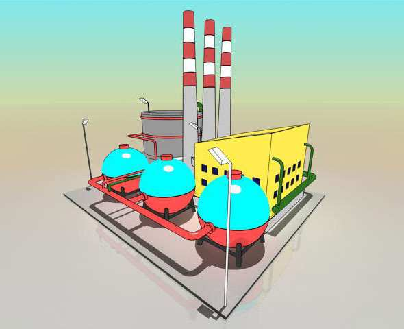

## [进程与线程](http://blog.chinaunix.net/uid-26833883-id-3224261.html)：

[转载处](http://www.ruanyifeng.com/blog/2013/04/processes_and_threads.html)

### 区别：

0. 计算机中:
   1. 进程是最小的资源分配单位；进程之间各自拥有各自的内存空间，**都是2^32（地址总线定）**
   1. 一个进程可以有多个线程，线程是最小的执行单元；线程共享进程的所有资源，包括缓冲区、调用栈（堆不是，只有部分）。
   1. 进程的中断代表资源的释放或者申请，线程的切换只是同一进程下**另一个执行路径的切换**而已。
   1. 进程的切换效率比较低，但是健壮性高；线程的切换效率高，但是一个线程死亡代表着整个进程的死掉，所以健壮性不高。
1. 计算机的核心是CPU，它承担了所有的计算任务。它就像一座工厂，时刻在运行。
 
 
2. 假定工厂的电力有限，一次只能供给一个车间使用(早期的CPU）。也就是说，一个车间开工的时候，其他车间都必须停工。
 背后的含义就是，单个CPU一次只能运行一个任务。
 
 
 
3. 进程就好比工厂的车间，它代表CPU所能处理的单个任务。任一时刻，CPU总是运行一个进程，其他进程处于非运行状态。
 
 
 
4. 一个车间里，可以有很多工人。他们协同完成一个任务。
 
 
5. 线程就好比车间里的工人。一个进程可以包括多个线程。
 
 
 
6. 车间的空间是工人们共享的，比如许多房间是每个工人都可以进出的。这象征一个**进程的内存空间是共享的，每个线程都可以使用这些共享内存。**
 
 
7. 可是，每间房间的大小不同，有些房间最多只能容纳一个人，比如厕所。里面有人的时候，其他人就不能进去了。这代表一个线程使用某些共享内存时，其他线程必须等它结束，才能使用这一块内存。
 
 
8. 一个防止他人进入的简单方法，就是门口加一把锁。先到的人锁上门，后到的人看到上锁，就在门口排队，等锁打开再进去。这就叫"互斥锁"（Mutual exclusion，缩写 Mutex），防止多个线程同时读写某一块内存区域。
 
 
 
9. 还有些房间，可以同时容纳n个人，比如厨房。也就是说，如果人数大于n，多出来的人只能在外面等着。这好比某些内存区域，只能供给固定数目的线程使用。
 
 
 
10. 这时的解决方法，就是在门口挂n把钥匙。进去的人就取一把钥匙，出来时再把钥匙挂回原处。后到的人发现钥匙架空了，就知道必须在门口排队等着了。这种做法叫做"信号量"（Semaphore），用来保证多个线程不会互相冲突。
 
 
 
 
**不难看出，mutex是semaphore的一种特殊情况（n=1时）。**也就是说，完全可以用后者替代前者。但是，因为mutex较为简单，且效率高，所以在必须保证资源独占的情况下，还是采用这种设计。


11. 操作系统的设计，因此可以归结为三点：<br>
（1）以多进程形式，允许多个任务同时运行；<br> 
    ```
    多进程方式的优点在于，设计和实现相对简单，各个子进程之间相互独立，处理客户端请求的过程彼此不受到干扰，
    并且当一个子进程产生问题时，不容易将影响蔓延到其他进程中，这保证了提供服务的稳定性。当子线程退出时，
    其占用资源会被操作系统回收，也不会留下任何垃圾。而其缺点也很明显。操作系统中生成一个子进程需要进行内存复制等操作，
    在资源和时间上回产生一定的额外开销，因此，如果Web服务器接收大量并发请求，就会对系统资源造成压力，导致系统性能下降.
    初期的Apache服务器就是采用这种方式对外提供服务的。为了应对大量并发请求，Apache服务器采用“预生成进程”的机制对多进程方式进行改进，
    “预生成进程”的工作方式很好理解。它将生成子进程的时机提前，在客户端请求还没有到来之前就预先生成好，当请求到来时，
    主进程分配一个子进程和该客户端进行交互，交互完成之后，该进程也不结束，而被主进程管理起来等待下一个客户端请求的到来，
    改进的多进程方式在一定程度上缓解了大量并发请求情形下Web服务器对系统资源造成的压力。但是优化Apache服务器在最初的构架设计上采用了多进程方式，因此这不能从根本上解决问题。
    ```
（2）以多线程形式，允许单个任务分成不同的部分运行；<br>
```
    由于操作系统产生一个线程的开销远远小于产生一个进程的开销，所以多线程方式在很大程度上减轻了Web服务器对系统资源的要求。
    该方式使用线程进行任务调度，开发方面可以遵循一定的标准，这相对来说比较规范和有利于协作。但在线程管理方面，有一定的不足。
    多个线程位于同一个进程内，可以访问同样的内存空间，彼此之间相互影响；同时，在开发过程中不过避免地要开发者自己对内存进行管理，其增加了出错的风险。
    服务器系统需要长时间连续不停地运转，错误的逐渐积累可能最终对整个服务器产生重大影响。IIS服务器使用了多线程方式对外提供服务，
     d它的稳定性相对来说还是不错的，但对于经验丰富的Web服务器管理人员而言，他们通常还是会定期检查和重启服务器，以预防不可预料的故障发生。
```
（3）提供协调机制，一方面防止进程之间和线程之间产生冲突，另一方面允许进程之间和线程之间共享资源。<br>
```python
所以对于单进程的JS语言来说，就会很浪费资源： 
Event Loop就是为了解决这个问题而提出的。Wikipedia这样定义： 
    "Event Loop是一个程序结构，用于等待和发送消息和事件。
    （a programming construct that waits for and dispatches events or messages in a program.）" 
简单说，就是在程序中设置两个线程：
    一个负责程序本身的运行，称为"主线程"；
    另一个负责主线程与其他进程（主要是各种I/O操作）的通信，被称为"Event Loop线程"（可以译为"消息线程"）。
python中通过协程来处理：async/await  分别用来定义协程函数和调用
    async def get_reddit_top(subreddit, client):
           data1 = await get_json(client, 'https://www.reddit.com/r/'+subreddit + '/top.json?
                                            sort=top&t=day&limit=5')
           j = json.loads(data1.decode('utf-8'))
           for i in j['data']['children']:
                 score = i['data']['score']
                 title = i['data']['title']
                 link = i['data']['url']
                 print(str(score) + ': ' + title + ' (' + link + ')')
           print('DONE:', subreddit + '\n')
    def signal_handler(signal, frame):
          loop.stop()
          client.close()
          sys.exit(0)
    signal.signal(signal.SIGINT, signal_handler)
    asyncio.ensure_future(get_reddit_top('python', client))
    asyncio.ensure_future(get_reddit_top('programming', client))
    asyncio.ensure_future(get_reddit_top('compsci', client))
    loop.run_forever()
```

###Linux与fork()
两种方式创建**进程**：
* 
操作系统：fork()，有两个返回值；**两个进程运行顺序不定**；有不同的栈段、数据段、堆段等，子进程采用写时拷贝(copy-on-write)拷贝来的(即啥时候修改啥时候拷贝过来)；
  * vfork实际上也是调用的fork，但共享父进程中数据，且保证子进程先执行，exit()结束子进程后父才会继续(不能同时！！！)，但是共享内存不安全，并不鼓励
  * 创建子进程就是一个clone的过程。目前**三个fork、clone、vfork**，其实后面两个都是调用的fork

* 
父进程自己创建

###return 和 exit的不同
* 
exit是系统调用，是不会退栈的，表示一个进程的结束！！它会将控制权交给系统（多线程返回给父进程），删除进程使用的内存空间，并将应用程序的一个状态返回给OS，这个状态标识了应用程序的一些运行信息，
* return不是系统调用是C语言的函数，它会退栈将执行控制权交给调用函数，引发退栈操作，子进程退栈的操作可能会修改父进程的栈，所有return不行。
* main函数中调用return，会隐式调用exit：非主函数中调用return和exit效果很明显，但是在main函数中调用return和exit的现象就很模糊，多数情况下现象都是一致的。
* fork和vfork中区别大，因为vfork是共享内存，所以可以exit，但是不能是return，否则子结束因为退栈把父的也改变了。

###[通信](http://blog.csdn.net/eroswang/article/details/1772350)：
1. 
同进程下不同线程：线程共享进程的内存空间，全局变量就可以了；
1. 
不同进程间不同线程：参考下一个进程间通信
1. 
linux下进程间通信的几种主要手段简介：
    1. 
管道（Pipe）及有名管道（named pipe）：两者提供的都是半双工的通信方式，单向传送；管道可用于具**有亲缘关系进程间的通信**，有名管道克服了管道没有名字的限制，因此，除具有管道所具有的功能外，它还允许无亲缘关系进程间的通信；
    1. 
信号（Signal）：信号是比较复杂的通信方式，用于通知接受进程有某种事件发生，除了用于进程间通信外，进程还可以发送信号给进程本身；linux除了支持Unix早期信号语义函数sigal外，还支持语义符合Posix.1标准的信号函数sigaction（实际上，该函数是基于BSD的，BSD为了实现可靠信号机制，又能够统一对外接口，用sigaction函数重新实现了signal函数）；
    1. 
报文（Message）队列（消息队列）：消息队列是消息的链接表，包括Posix消息队列system V消息队列，在内核中。有足够权限的进程可以向队列中添加消息，被赋予读权限的进程则可以读走队列中的消息。消息队列克服了信号承载信息量少，管道只能承载无格式字节流以及缓冲区大小受限等缺点。
    1. 
共享内存：使得多个进程可以访问同一块内存空间，是最快的可用IPC形式。是针对其他通信机制运行效率较低而设计的。往往与其它通信机制，如信号量结合使用，来达到进程间的同步及互斥。
    1. 
信号量（semaphore）：主要作为进程间以及同一进程不同线程之间的同步手段。信号量是一个计数器，可以用来控制多个进程对共享资源的访问。它常作为一种锁机制，防止某进程正在访问共享资源时，其他进程也访问；
    1. 
套接口（Socket）：更为一般的进程间通信机制，可用于不同机器之间的进程间通信。起初是由Unix系统的BSD分支开发出来的，但现在一般可以移植到其它类Unix系统上：Linux和System V的变种都支持套接字。
1. 
IPC：在IPC的通信模式下，不管是使用消息队列还是共享内存，甚至是信号灯，每个IPC的对象都有唯一的名字,称为"键"(key)。通过"键"，进程能够识别所用的对象。"键"与IPC对象的关系就如同文件名称于文件，通过文件名，进程能够读写文件内的数据，甚至多个进程能够公用一个文件。而在 IPC的通讯模式下，通过"键"的使用也使得一个IPC对象能为多个进程所共用。
    * 
消息队列：系统内核中保存的队列；可是正在被管道和套接字淘汰；
    * 
共享内存：最快的方式；需要信号量或者其他的合作，从而保证读时已经有数据了。
        * 
shmget(申请一块)、shmat(映射到自身)、shmctl(控制内存状态或标志位)
    * 
信号量：本质是一个计数器，记录对某一个资源的读取情况。

##多线程VS多进程
经常在网络上看到有的XDJM问“多进程好还是多线程好？”、“Linux下用多进程还是多线程？”等等期望一劳永逸的问题，我只能说：没有最好，只有更好。根据实际情况来判断，哪个更加合适就是哪个好。
* 
我们按照多个不同的维度，来看看多线程和多进程的对比（注：因为是感性的比较，因此都是相对的，不是说一个好得不得了，另外一个差的无法忍受）。

| 对比维度 | 多进程 | 多线程 | 总结 |
| -- | -- | -- | -- |
| 数据共享、同步 | 数据共享复杂，需要用IPC；数据是分开的，同步简单 | 因为共享进程数据，数据共享简单，但也是因为这个原因导致同步复杂 | 各有优势 |
| 内存、CPU | 占用内存多，切换复杂，CPU利用率低 | 占用内存少，切换简单，CPU利用率高 | 线程占优 |
| 创建销毁、切换 | 创建销毁、切换复杂，速度慢 | 创建销毁、切换简单，速度很快 | 线程占优 |
| 编程、调试 | 编程、调试简单 | 复杂 | 进程占优 |
| 可靠性 | 进程间不会互相影响 | 一个线程死掉整个进程也完了 | 进程占优 |
| 分布式 | 扩展方便 | 不宜使用 | 进程占优 |

####没有绝对的好与坏，只有哪个更加合适的问题。我们来看实际应用中究竟如何判断更加合适。

###结论：
* 
需要频繁创建销毁的优先用线程
这种原则最常见的应用就是Web服务器了，来一个连接建立一个线程，断了就销毁线程，要是用进程，创建和销毁的代价是很难承受的
* 
需要进行大量计算的优先使用线程：即CPU密集型操作
这种原则最常见的是图像处理、算法处理。
* 可能要扩展到多机分布的用进程，多核分布的用线程
原因请看上面对比。
* 都满足需求的情况下，用你最熟悉、最拿手的方式

至于“数据共享、同步”、“管理即创建调度销毁等操作”、“编程、调试”、“可靠性”这几个维度的所谓的“复杂、简单”应该怎么取舍，我只能说：没有明确的选择方法。但我可以告诉你一个选择原则：如果多进程和多线程都能够满足要求，那么选择你最熟悉、最拿手的那个。

####注：
需要提醒的是：虽然我给了这么多的选择原则，但实际应用中基本上都是“进程+线程”的结合方式，千万不要真的陷入一种非此即彼的误区。

#异步方式
异步方式是和多进程方式及多线程方式完全不同的一种处理客户端请求的方式。在介绍改方式之前 ，我们先复习下同步、异步以及阻塞、非阻塞的概念。
###同步、异步概念：通信双方步调是否一致  
网络通信中的同步机制和异步机制是描述通信模块的概念。同步机制，是指发送方发送请求后，需要等待接收到接收方发回的响应后(**轮训**)，才接着发送下一个请求；异步机制，和同步机制正好相反，在异步机制中，发送方发出一个请求后，不等待接收方响应这个请求，就继续发送下个请求。在同步机制中，所有的请求在服务器端得到同步，发送方和接收方对请求的处理步调是一致的；在异步机制中，所有来着发送方的请求**形成一个队列**，接收方处理完成后通知发送方。
===》同步异步就看接收者是否主动通知 , 发送方是否一直轮询
###阻塞、非阻塞概念：进程调用是否需要等待
　　阻塞和非阻塞用来描述进程处理调用的方式，在网络通信中，主要指网络套接字Socket的阻塞和非阻塞方式，而Socket的实质也是IO操作，Socket的阻塞调用方式为，调用结果返回之前，当前线程从运行状态被挂起，一直等到调用结果返回之后，才进行就绪状态，获取CPU后继续执行；Socket的非阻塞调用方式和阻塞方式调用方式正好相反，在非阻塞方式中，如果调用结果不能马上返回，当前线程也不会被挂起，而是立即返回执行下一个调用。
＝＝》阻塞、非阻塞就看调用者是否等待，发送方是否原地空转

同步和阻塞看当前进程是否可以去处理其他任务：同步阻塞、同步非阻塞
[连接](http://blog.csdn.net/paincupid/article/details/51811717)

###联系
　　在网络通信中，经常可以看到有人讲同步和阻塞等同、异步和非阻塞等同。事实上，这两对概念有一定的区别，不能混淆。两对概念的组合，就会产生四个新的概念，同步阻塞、异步阻塞、同步非阻塞、异步非阻塞。
    * 同步阻塞方式，发送方向接收方发送请求后，一直等待响应；接收方处理请求是进行的IO操作如果不能马上得到结果，就一直等到返回结果后，才响应发送方，期间不能进行其他工作。比如、在超时排队付账时，客户（发送方）想收款员（接收方）付款（发送请求）后需要等待收款员找零，期间不能做其他的事情；而收款员要等待收款机返回结果（IO操作）后才能把零钱取出来交给客户（响应请求），期间也只能等待，不能做其他的事情。这种方式实现简单，但是效率不高。
    * 同步非阻塞方式，发送方向接收方发送请求后，一直等待响应；接收方处理请求时进行的IO操作如果不能马上得到结果，就立即返回，去做其他事情，但由于没有得到请求处理结果，不响应发送方，发送方一直在等待，一直等IO操作完成后，接收方获得结果响应发送方后，接收方才进入下一次请求过程。在实际中不使用这种方式。
    * 异步阻塞方法，发送方向接收方发送请求后，不用等待响应，可以继续其他工作；接收方处理请求是进行的IO操作如果不能马上得到结果，就一直等到返回结果后，才响应发送方，期间不能进行其他工作。这种方式在实际中也不使用。
    * 异步非阻塞方式，发送方向接收方发送请求后，不用等待响应，可以继续其他工作；接收方处理请求时进行的IO操作富国不能马上得到结果，也不等待，而是马上返回去做其他事情。当IO操作完成以后，将完成状态和结果通知接收方，接收方再响应发送方。继续使用在超市付账排队的例子。客户（发送方）想收款员（接收方）付款（发送请求）后在等待收款员找零的过程中，还可以做其他事情，比如打电话、聊天等；而收款员在等待收款机处理交易（IO操作）的过程中可以帮助客户将商品打包，当收款机产生结果后，收款员给客户结账（响应请求）。在四种方式中，这种方式是发送方和接收方通信效率最高的一种。

老张爱喝茶，废话不说，煮开水。出场人物：老张，水壶两把（普通水壶，简称水壶；会响的水壶，简称响水壶）。
1. 老张把水壶放到火上，立等水开。（同步阻塞）老张觉得自己有点傻
2. 老张把水壶放到火上，去客厅看电视，时不时去厨房看看水开没有。（同步非阻塞）老张还是觉得自己有点傻，于是变高端了，买了把会响笛的那种水壶。水开之后，能大声发出嘀~~~~的噪音。
3. 老张把响水壶放到火上，立等水开。（异步阻塞）老张觉得这样傻等意义不大
4. 老张把响水壶放到火上，去客厅看电视，水壶响之前不再去看它了，响了再去拿壶。（异步非阻塞）老张觉得自己聪明了。
所谓同步异步，只是对于水壶而言。普通水壶，同步；响水壶，异步。虽然都能干活，但响水壶可以在自己完工之后，提示老张水开了。这是普通水壶所不能及的。**同步只能让调用者去轮询自己**（情况2中），造成老张效率的低下。所谓阻塞非阻塞，仅仅对于老张而言。立等的老张，阻塞；看电视的老张，非阻塞。情况1和情况3中老张就是阻塞的，媳妇喊他都不知道。虽然3中响水壶是异步的，可对于立等的老张没有太大的意义。所以一般**异步是配合非阻塞使用**的，这样才能发挥异步的效用。


[返回目录](README.md)